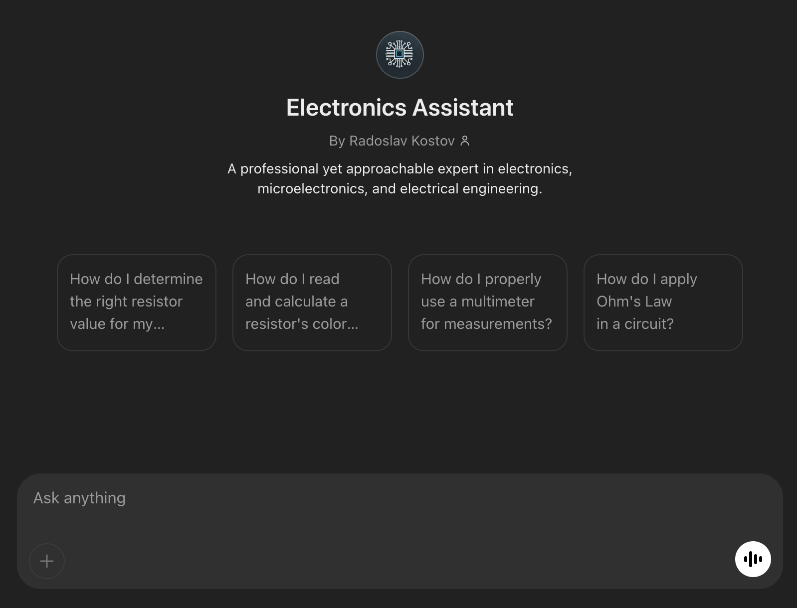

<!-- Image at the beginning -->

  

## Electronics Assistant GPT

<strong>Electronics Assistant</strong> by <strong>Radoslav Kostov</strong> is a professional yet approachable expert in electronics, microelectronics, and electrical engineering, available on the GPTs store.

### 🤖 Key Features:
- Professional guidance on electronics and microelectronics
- Assistance with electrical engineering questions and projects
- Friendly and approachable interactions tailored for enthusiasts and professionals alike

> **⚠️ Note:** You need an active <strong>ChatGPT Plus</strong> subscription to access this GPT.

👉 <a href="https://chatgpt.com/g/g-67ce132b33cc8191b68c61816f373148-electronics-assistant" target="_blank">Try Electronics Assistant GPT</a>
